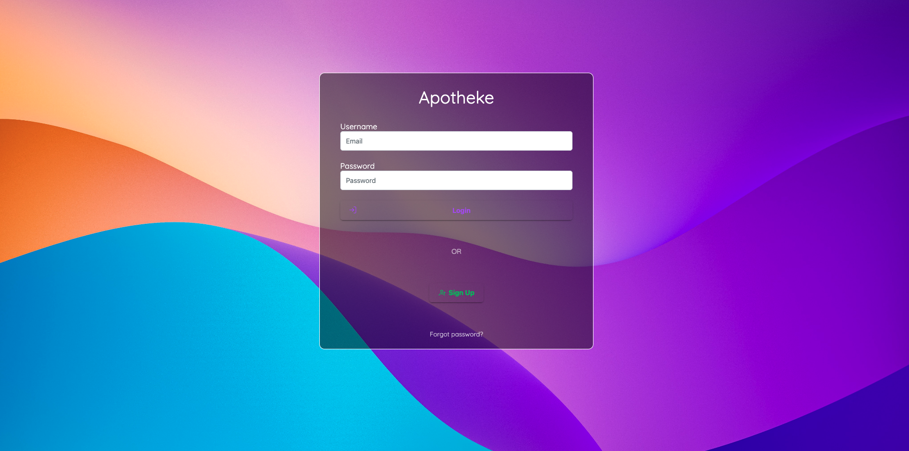
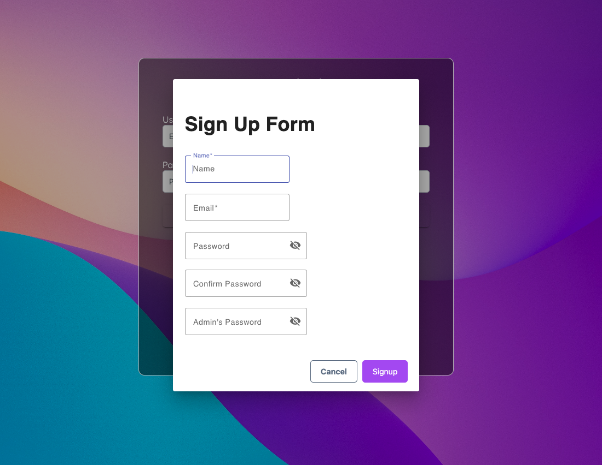
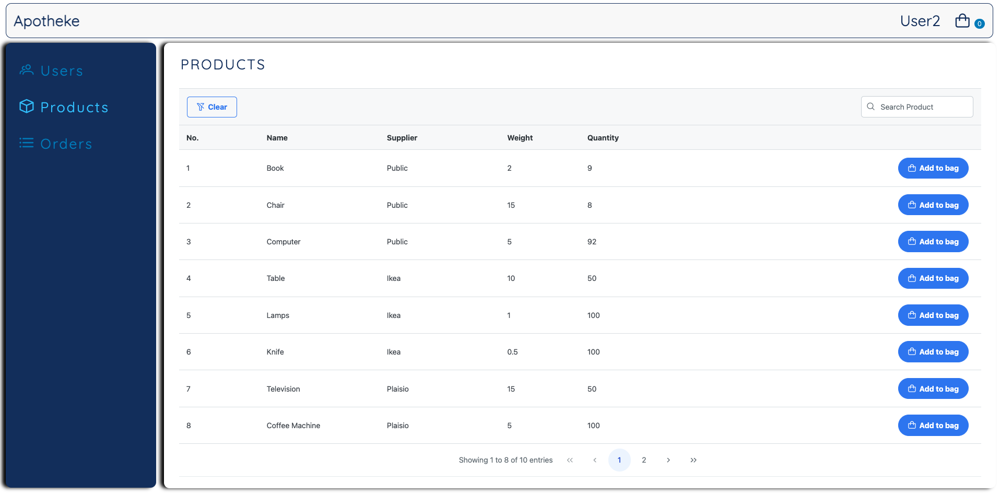
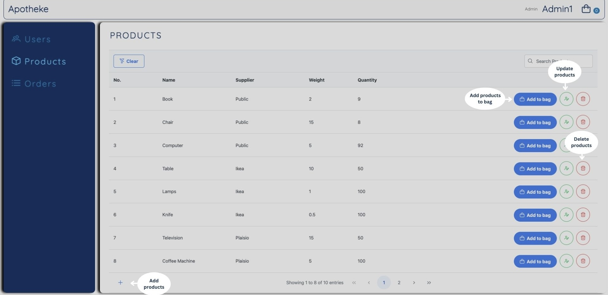
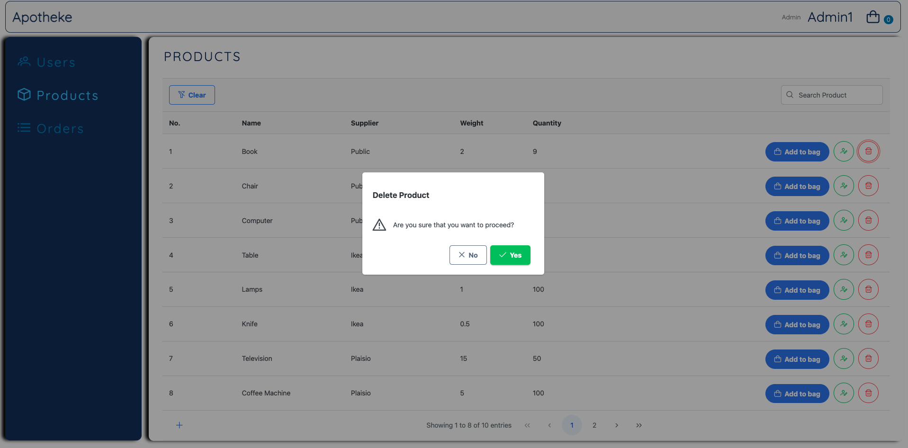
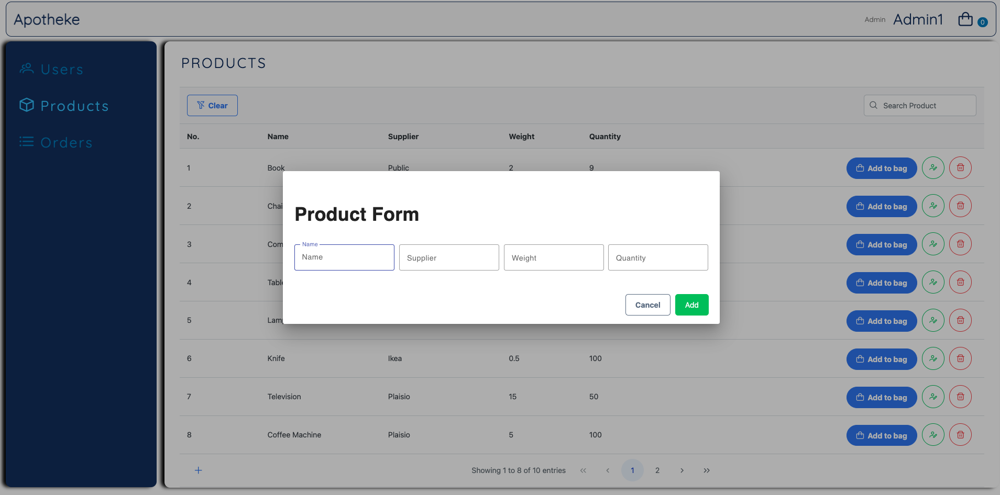
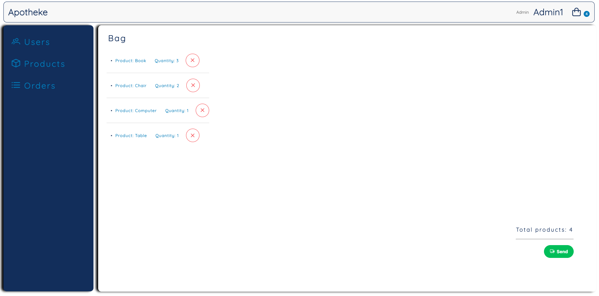
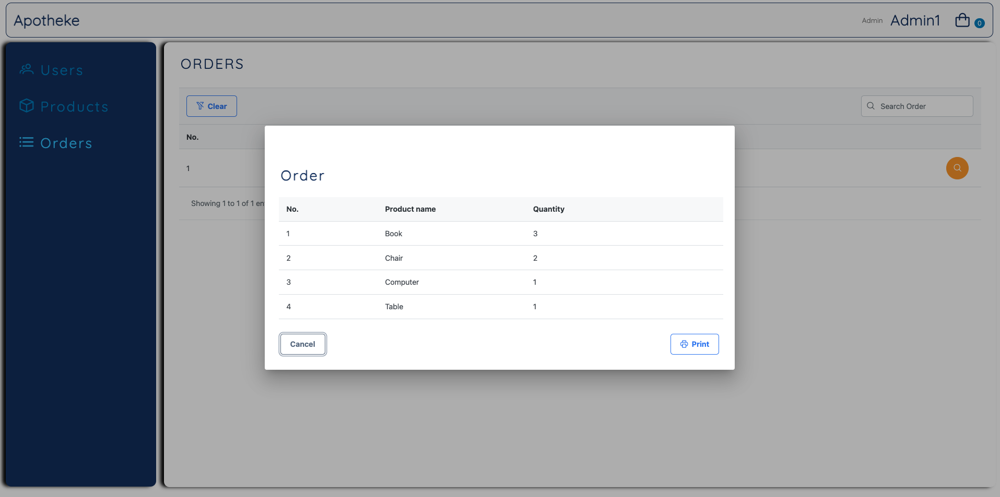

# Apotheke

## 🚀 About Apotheke

Apotheke is a web application designed to **streamline order management** for users and administrators. It provides a seamless experience for placing, tracking, and managing orders. Whether you're a regular user or an admin, Apotheke ensures smooth operations with an intuitive interface and other features.

## 🛠 Tech Stack
- Frontend: AngularJS
- Backend: Node.js
- Database: MongoDB
- Authentication: JWT

## 👥 User Roles

- **Users**: 
  - Can log in or sign up.
  - View tabs such as **Products, Suppliers, Users, and Orders**.
  - Add products to their bucket and send orders.

- **Admins**: 
  - Have all user functionalities.
  - Can **update** product details (e.g., quantity) and modify user information (e.g., name).

## ✨ Features

- 🔹 **Log in & Sign up** – Authenticate as an admin or user.
- 🔹 **CRUD Operations** – Create, update, and delete **users, products, and other models**.
- 🔹 **Order Management** – Make and track orders easily.
- 🔹 **Print Orders** – Generate printable order summaries.
- 🔹 **JWT Authentication** – Secure user sessions with token-based authentication.

## 📸 Screenshots

Here are some snapshots of Apotheke in action:

### 1️⃣ Login Page

*Users and admins can log in securely using their credentials. JWT authentication ensures safe session management.*

### 2️⃣ Sign Up Panel

*New users and admins can register for an account by providing necessary details.*

### 3️⃣ Product List (User View)

*Users can browse available products and add items to their bag for ordering.*

### 4️⃣ Product List (Admin View)

*Admins can add, edit, and delete products, as well as add products to their bag.*

### 5️⃣ Delete Panel

*Admins can remove products from the inventory using this confirmation panel.*

### 6️⃣ Update Panel

*Admins can modify product details, such as quantity.*

### 7️⃣ Add Panel

*Admins can add new products to the inventory by filling in necessary details.*

### 8️⃣ Bag Page

*Users can review their selected products before placing an order.*

### 9️⃣ View Order Panel (with Print Action)

*Users and admins can review order details, with an option to print the order summary.*

